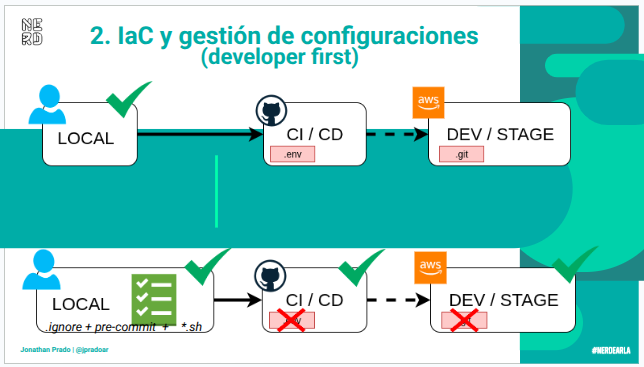

# DevSecOps sin humo 

Este repositorio acompaña mi charla en Nerdear.la 2025 sobre cómo aplique DevSecOps en la vida real, con todo lo bueno, lo malo y los incidentes que aprendí a contener.

Mi objetivo es dejar ejemplos prácticos y documentación abierta para que cualquier persona pueda usar, forkar y reutilizar lo que a mí me funcionó. Y que esto quede reflejado en el README como un primer "camino paso a paso" del pipeline completo (con jobs y stages).  Obviamente cada empresa/proyecto es un mundo asi que acá sentite libre de modificar lo que necesites o usar lo que te convenga.

  

### Estructura del repo

    ├── app/                 # Ejemplo de aplicación vulnerable + Dockerfile
    ├── terraform/           # Infraestructura como código (IaC)
    ├── vuln_scans/          # Ejemplo de reporte HTML de escaneo
    ├── img/                 # Diagramas e imágenes de apoyo
    ├── internal-checks.sh   # Script de validaciones internas
    ├── data.json            # Datos de ejemplo (para triggers/demos)
    ├── README.md            # Este archivo :)

 
 

### Principios

1. **Cambio de mindset**:  No es checklist, es entender qué puede salir mal.
2. **Shift Left**:  Seguridad desde el inicio del ciclo de vida.  (...o lo antes posible)
3. **Seguridad proactiva**: Evaluar lo que se va a publicar, evitar manejar secretos,tokens etc
4. **Automatización con propósito**:  IaC, pipelines auditables, rollback seguro.
5. **Monitoreo y observabilidad**:  Logs, métricas, trazas y validaciones post-deploy.
6. **Cultura colaborativa**:  Dev + Sec + Ops trabajando con feedback continuo.

 
 

# Cómo usar este repo

### 1. Pre-commit hooks

Ejemplo:  **pre-commit-config.yaml**

 - Validación de secrets.
 - Linters y formateo.
 - Scanners básicos antes de subir el código.

Acordate de instalar pre-commit en tu local, o si sos muy mañoso usalo en un docker.

    pip install pre-commit   (al momento de la charla use pre-commit v4.3.0)
    pre-commit install
    pre-commit run --all-files

Ejemplo:

    echo "superdupersecret" > hola.txt
    git add hola.txt
    git commit -m "nuevo archivo"
        # Ojo, hacer el pre-commit antes del push...
    pre-commit run -a
    git push origin <branch>

Resumen

    Archivos nuevos          necesitas git add antes de que pre-commit los vea.
    Archivos en staging    se analizan automáticamente en cada git commit.
    Revisión global        usa pre-commit run --all-files.

  

### 2. Pipelines CI/CD

Ejemplo: .github/workflows/DevSecOps.yaml

1. 🟢 Pre-checks                                  linters, pre-commit, secretos.
2. 🛠 Build & Test                                compilación reproducible, tests unitarios.
3. 🔍 Análisis de seguridad              SAST + IaC scanning (tfsec, trivy).
4. 🚀 Deploy controlado                       Terraform (terraform/).
5. 🧪 Validaciones post-deploy        DAST / Nuclei.
6. 📊 Monitoreo y observabilidad  logs, métricas y trazas.
7. 🔁 Feedback loop                               métricas visibles + vulnerabilidades evitadas.

<pre>

Pre-checks
    - Validar formato y calidad de código (linters).
    - Pre-commit hooks para evitar secrets, claves o tokens en commits.

Build & Test
    - Compilación o build reproducible.
    - Tests unitarios y de integración.

Análisis de seguridad
    - SAST: análisis estático de código.
    - IaC scanning: tfsec para Terraform, trivy para imágenes de contenedor.

Deploy controlado
    - Despliegue con IaC.
    - Deploy auditado (commit = deploy).
    - Feedback inmediato si algo falla.

Validaciones post-deploy
    - DAST con Nuclei u otras herramientas.
    - Validación de endpoints y URLs públicas.

Monitoreo y observabilidad
    - Logs, métricas y trazas.
    - Alertas tempranas de incidentes.

Feedback loop
    - Métricas visibles en el pipeline.
    - Reporte de Vulns evitadas antes de llegar a Prod (esto alimenta los pre-commits)
            y ayuda a otros miembros del Team

</pre>

  

### 3. Ciclo de vida DevSecOps

| Objetivo             | Descripción                                                                | Ejemplo en repo                  |
|---                   |---                                                                         |---                               |
| Planificación        | Casos de uso y abuso, definición de riesgos                                | docs/ (próximamente)             |
| Desarrollo           | Linters, pre-commit, code reviews                                          | app/, .pre-commit-config.yaml    |
| Integración continua | SAST, control de secretos, builds reproducibles                            | .github/workflows/DevSecOps.yaml |
| Deploy               | IaC validado, escaneo de imágenes, pipelines auditables                    | terraform/                       |
| Post-deploy          | Validaciones automáticas (Nuclei, scanners), monitoreo y observabilidad    |vuln_scans/                       |
| Feedback             | Incidentes evitados, métricas de seguridad y mejoras continuas             |internal-checks.sh                |

  

### 4. Recursos útiles

| Tool      | descripción                             | uso generico                                            | 
|---        |---                                      |---                                                      |
| tfsec     | análisis de seguridad en Terraform.     | mitigar lo más posible antes de deployar                |
| trivy     | escaneo de vulnerabilidades.            | validar que tan criticos son nuestros CVEs              |
| Nuclei    | validación de endpoints y URLs públicas | simular lo que veria un atacante                        |
| pre-commit| filtro de hooks locales                 | evitar que datos sensibles o vulerables lleguen al repo |

  

### 5. Contribuciones

Este repo está pensado para crecer con ejemplos reales de la comunidad.
Si tenés una receta, script o pipeline que te funcionó, por mas minimo o simple que sea, hacé una PR!!!

  

  
     

Recordá que todo lo que sube al repo, queda en el log, asi que si ya subiste un secreto o similar, cambialo y para la prox podes implementar pre-commits para evitar subir cualquier tipo de password, secreto o dato potencialmente peligroso   :D

 
 

## Ejemplos para la demo

#### Triggering (errores intencionales)

        sed -i 's/xxxxx/60f41f67-b43b-4552-bb80-f2f29b861ef99/g' data.json && \
        sed -i 's/zzzzz/SuperSecretPassword1234!/g' app/app.py && \
        sed -i 's/99.99.99.99\/32/0.0.0.0\/0/g' terraform/sg.tf

        git pull; git status ; git add --all ;  git commit -m "fix: fake workflow" ; git push origin main

#### Restorear

        sed -i 's/60f41f67-b43b-4552-bb80-f2f29b861ef99/xxxxx/g' data.json && \
        sed -i 's/SuperSecretPassword1234!/zzzzz/g' app/app.py && \
        sed -i 's/0.0.0.0\/0/99.99.99.99\/32/g' terraform/sg.tf

        git pull; git status ; git add --all ;  git commit -m "fix: rollback workflow" ; git push origin main

#### Reset to first commit

        git reset --hard  8f19d216282d1516ad3fedf7b28e2bebb23b36c6
        git push -f origin main

</pre>
